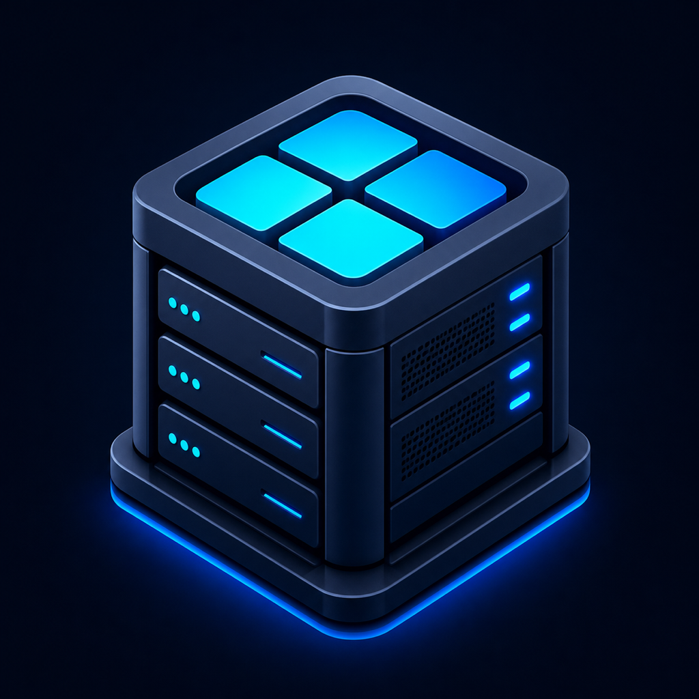

  

<h1 align="center">DevBoxMobile — Support</h1>

  Public support, feedback, and privacy information for the
  <strong>DevBoxMobile</strong> iOS app (<code>com.devboxmobile.app</code>).

  <a href="https://github.com/gavinz0228/mobile-dev-box-support/issues">Report a bug</a>
  ·
  <a href="https://github.com/gavinz0228/mobile-dev-box-support/issues">Request a feature</a>
  ·
  <a href="https://github.com/gavinz0228/mobile-dev-box-support/blob/main/PRIVACY.md">Privacy policy</a>

---

## About DevBoxMobile

DevBoxMobile is a native remote workspace for iPhone and iPad. It connects to
servers you own or administer and brings everyday maintenance work into one app:

- Discover and organize servers, then inspect live status and services.
- Open interactive SSH shells in tabs, including persistent tmux sessions.
- Browse and transfer files over SFTP, manage Docker containers, and search logs.
- Run read-only checks across servers and launch saved maintenance actions.
- Build and test HTTP requests, monitor endpoints, and browse supported databases.
- Find supported remote coding agents and inspect their running processes.
- Reach private web services through on-demand SSH port forwarding.
- Keep credentials in Apple Keychain behind optional Face ID or Touch ID, with
  encrypted local export and optional iCloud backup.

DevBoxMobile does not host a server for you. Remote features require a server or
service you own or administer, suitable network access, and the relevant
credentials. Some features depend on software installed on the remote host.

## Getting help

| I want to… | Where to go |
| --- | --- |
| Report a bug or something broken | [Open an issue](https://github.com/gavinz0228/mobile-dev-box-support/issues/new?template=bug_report.yml) |
| Ask a question or get setup help | [Open an issue](https://github.com/gavinz0228/mobile-dev-box-support/issues/new) |
| Suggest a feature | [Open an issue](https://github.com/gavinz0228/mobile-dev-box-support/issues/new?template=feature_request.yml) |
| Report a security or privacy concern | Read [SECURITY.md](SECURITY.md); do not publish sensitive details |
| Read the privacy policy | [PRIVACY.md](https://github.com/gavinz0228/mobile-dev-box-support/blob/main/PRIVACY.md) |

You can also reach support from inside the app: **Settings → Help & Feedback →
Report a Bug on GitHub**.

Issues are public and searchable, so **never post passwords, SSH keys, private
hostnames, IP addresses, tokens, or server logs that contain them**. Redact
anything sensitive first.

## What to include in a report

- App version and build (Settings → Help & Feedback shows them), plus your iOS
  version and device model.
- What you did, what you expected, and what happened instead.
- Whether the affected server is Linux, macOS, or Windows, if the problem
  involves a remote feature.
- The exact error text shown in the app, with any credentials removed.

## Privacy

DevBoxMobile does not collect, sell, or transmit personal information to the
developer. Server profiles, request history, preferences, and task history stay
on your device; credentials and private keys stay in Apple Keychain. See
[PRIVACY.md](PRIVACY.md) for the full policy.

## Repository scope

This repository holds support documentation and issue tracking only. The
DevBoxMobile application source code is maintained in a separate private
repository, so code is not published here.

## License

The documentation in this repository is available under the [MIT License](LICENSE).
